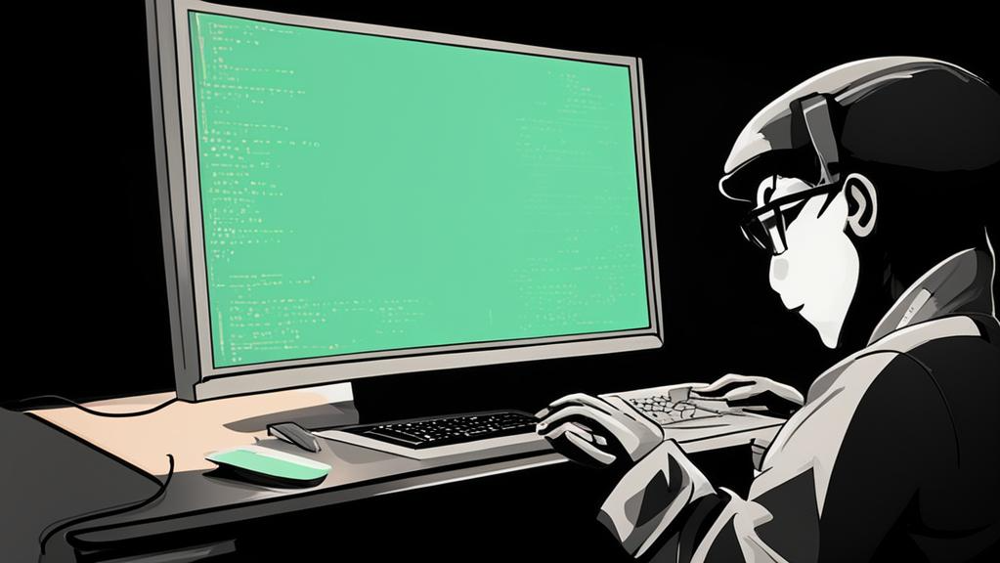

## Задачи Core-1

Этот учебный проект направлен на практику различных концепций Java Core. Необходимо выполнить следующие задачи:

- Создать метод, который возвращает сумму двух чисел.
- Создать метод, который возвращает сумму двух строк.
- Создать метод, который принимает строку, содержащую число, и другое число в качестве аргументов, и возвращает сумму чисел в виде строки.
- Создать метод, который принимает строку и число. Если число внутри строки больше переданного числа, вернуть false; в противном случае вернуть true.
- Создать метод, который принимает две логические переменные. Если обе переменные равны true, вернуть true; если хотя бы одна из них равна true, вернуть true; если обе переменные равны false, вернуть false.
- Создать метод, который принимает число и возвращает true, если оно четное, и false, если оно нечетное.
- Создать метод, который проверяет числа в массиве. Если все числа четные, вернуть "Массив четных чисел"; если есть и четные, и нечетные числа, вернуть "Массив четных и нечетных чисел"; если в массиве только нечетные числа, вернуть "Массив нечетных чисел".
- Создать метод, который принимает массив чисел и возвращает новый массив, содержащий сумму всех элементов.
- Создать метод, который принимает массив чисел и возвращает сумму всех элементов.
- Создать методы для подсчета полных месяцев, минут и часов в заданном возрасте.
- Создать метод, который принимает два имени и проверяет, являются ли они одинаковыми, независимо от регистра.
- Создать метод, который принимает массив элементов и возвращает последний элемент.
- Создать метод для подсчета количества букв 'А' в строке.
- Создать метод для работы с кошельком. У него есть начальная сумма, и можно вычитать деньги, пока они не закончатся или сумма не станет слишком большой.
  

